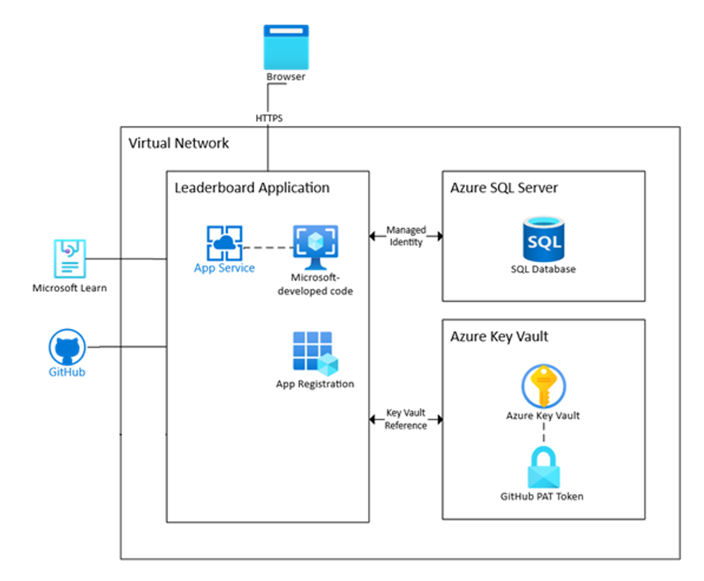
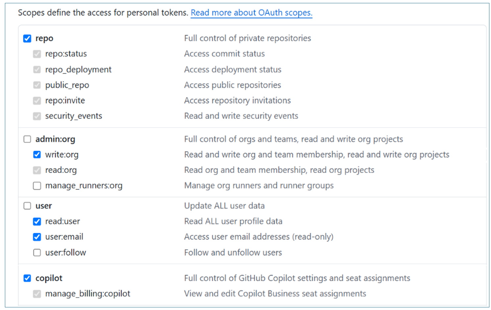

# GitHub Copilot Adoption Challenge Leaderboard App

## Overview
The **GitHub Copilot Adoption Challenge Leaderboard App** is a web application that tracks and manages scores for individual participants and teams during the GitHub Copilot Adoption Challenge. The application rewards teams (and individuals) with points for completing activities including use of GitHub Copilot tools such as code completion and Copilot Chat.

The app periodically updates the leaderboard based on accumulated points so that both individual contributions and team performance are reflected accurately. It is a monolithic ASP.NET application (frontend + backend) targeting .NET 8 and uses Azure SQL for persistence. This document assumes deployment to **Azure App Service**.

---
## Key Features
- **Leaderboard Homepage**: Displays team standings, scores, and announcements.
- **User Authentication**: Login, passcode generation / validation, token refresh, and logout.
- **Participant Management**: CRUD operations for participants.
- **Participant Scores Management**: Retrieve and create participant scores based on weighted activities; automatically updates leaderboard.
- **Survey Participation & Submission**: Authenticated users submit survey responses; validated and stored.
- **User-Driven Team Creation**: Users can create teams (name, tagline, icon) prior to challenge start.
- **Team Management & Locking**: Users may select a team until the challenge starts; teams lock afterward.
- **Announcements**: Admin-posted announcements and links (optionally point-bearing activities).
- **Admin Team Management**: Full CRUD for teams.
- **Team Metrics Management**: Daily summaries of team metrics can be ingested and reflected in scores.
- **User Profile Management**: Users view/update their profile and team assignment (subject to challenge status).

---
## Architecture (Conceptual)
A simplified architecture consists of:
1. Azure App Service (Web App) hosting the .NET 8 application.
2. Azure SQL Database for persistence (participant, team, score, metrics, and announcement data).
3. Azure Key Vault for secrets (GitHub PATs, SMTP credentials, client secrets if applicable).
4. Azure AD (Entra ID) for authentication & authorization of users.
5. External APIs (GitHub, Microsoft Learn) queried over HTTPS.

> NOTE: This is a monolith (no discrete microservices). Scaling is handled at the App Service plan level.



---
## Deployment & Identity Prerequisites
### Create System-Assigned Managed Identity (App Service)
1. In the Azure Portal, navigate to the App Service.
2. Under Identity > System assigned, set Status = On and save.
3. Note the principal ID (used implicitly when granting SQL roles & Key Vault access). No secrets are required for this identity.
4. Grant this identity access to Key Vault (Secrets User) and Azure SQL (see T-SQL below) after the first connection attempt or pre-create the user via an Azure AD admin.

---
## Requirements
### 1. Azure App Service
- Deploy code-based .NET 8 binaries.
- Enable **System-Assigned Managed Identity** (used for Azure SQL + Key Vault access).
- TLS termination with Azure-managed certificate (HTTPS / port 443).
- Configure SMTP server for outbound email (account management / notifications as needed).
- Expose only port 443 publicly.

### 2. Azure SQL Database
- Port 1433 (private endpoint recommended).
- Azure AD authentication using App Service managed identity (roles: `db_ddladmin`, `db_datareader`, `db_datawriter`).
- Private endpoint inside same Virtual Network for restricted access.

#### Granting Database Roles to Managed Identity
Run as an Azure AD admin on the target database (replace `<identity-name>` with the managed identity name – typically the App Service name):
```sql
CREATE USER [<identity-name>] FROM EXTERNAL PROVIDER;
ALTER ROLE db_datareader ADD MEMBER [<identity-name>];
ALTER ROLE db_datawriter ADD MEMBER [<identity-name>];
ALTER ROLE db_ddladmin ADD MEMBER [<identity-name>];
GO
```
Reference: Tutorial for managed identity & SQL: https://learn.microsoft.com/en-us/azure/app-service/tutorial-connect-msi-sql-database?tabs=windowsclient%2Cefcore#grant-database-admin-access-to-a-microsoft-entra-user

### 3. Azure Key Vault
- Store: GitHub PATs, SMTP password, Azure AD (client secret if used), any other secrets.
- Grant App Service Managed Identity: **Key Vault Secrets User** role / access policy.
- Use Key Vault references in App Service configuration, e.g.:  
  `@Microsoft.KeyVault(SecretUri=https://devbox-akv.vault.azure.net/secrets/GitHub-PAT/)`

### 4. Networking Requirements
- App Service VNet Integration + private endpoints (SQL, Key Vault) in same VNet.
- Private DNS Zones linked:  
  - `privatelink.database.windows.net` → VNet (Azure SQL)  
  - `privatelink.vaultcore.azure.net` → VNet (Key Vault)
- Outbound HTTPS (443) to: GitHub API, Microsoft Learn endpoints, `login.microsoftonline.com`.
- DNS resolution (port 53) for external domains.
- If GitHub Enterprise is self-hosted: ensure VPN / firewall rules allow outbound connectivity.
- Ensure endpoints accessible from App Service:  
  - `login.microsoftonline.com`  
  - `api.github.com`

### 5. Authentication (GitHub)
- Use a **Personal Access Token (PAT)** with scopes sufficient for:  
  - GitHub Teams API  
  - GitHub Admin / User Management API  
  - GitHub Copilot API (if required)  
- Verify PAT authorization for the org:  
  Settings → Developer settings → Personal access tokens → Ensure org shows Authorized.  
- Store PAT in Key Vault (never in source). Retrieve via Key Vault reference at runtime.



Example passwordless connection string (Managed Identity):
```
Server=tcp:sqlserver.database.windows.net,1433;Database=leaderboard-db;Encrypt=True;TrustServerCertificate=False;Authentication=Active Directory Default;
```

### 6. Azure App Registration (Entra ID)
| Setting | Description |
|--------|-------------|
| Display Name | App Registration display name |
| Application (client) ID | Client ID GUID |
| Directory (tenant) ID | Tenant ID GUID |
| Object ID | Service principal object ID |
| Supported Account Types | Single tenant |
| Managed Application Link | (If applicable) |

#### Redirect URIs
- Web platform redirect URI:  
  `https://<your-app-service>/signin-oidc`
- (Legacy) Implicit grant configured only if required. Prefer Authorization Code flow with PKCE for modern clients.

#### Client Credentials
- Authentication Method: Client Secret (recommend certificate for production).  
- Store secret value in Key Vault (`@Microsoft.KeyVault(SecretUri=https://devbox-akv.vault.azure.net/secrets/AzureAd-ClientSecret/)`).  

#### API Permissions (Minimal)
- Microsoft Graph (Delegated):  
  - `User.Read`  
  - `openid`  
  - `profile`  
- Admin consent may be required.

#### Token / Auth Settings
- Platform: Web
- Redirect URI: `/signin-oidc`
- ID tokens enabled (OpenID Connect)
- Refresh tokens (optional, depending on flow)

---
## Azure App Service: Configuration (App Settings)
### 1. Challenge Settings
| Key | Example Value |
|-----|---------------|
| `ChallengeSettings__MaxParticipantsPerTeam` | 8 |
| `ChallengeSettings__ChallengeStarted` | false |
| `ChallengeSettings__ChallengeStartDate` | 2025-10-04 |

### 2. Database Configuration
| Key | Value |
|-----|-------|
| `Database__Provider` | SqlServer (or PostgreSQL) |

Connection Strings (in App Service Connection Strings section):
| Name | Example Value | Type |
|------|---------------|------|
| `PostgreSQL` | `Host=<host>;Database=<db>;Username=<user>;Password=<password>` | PostgreSQL |
| `SqlServer` | `Server=tcp:sqlserver.database.windows.net,1433;Database=leaderboard-db;Encrypt=True;TrustServerCertificate=False;Authentication=Active Directory Default;` | SQLAzure |

### 3. Azure AD Settings (App Settings Keys)
| Key | Example / Source |
|-----|------------------|
| `AzureAd__Domain` | `<yourtenant>.onmicrosoft.com` |
| `AzureAd__TenantId` | `xxxxxxxx-xxxx-xxxx-xxxx-xxxxxxxxxxxx` |
| `AzureAd__ClientId` | `xxxxxxxx-xxxx-xxxx-xxxx-xxxxxxxxxxxx` |
| `AzureAd__CallbackPath` | `/signin-oidc` |
| `AzureAd__ClientSecret` | `@Microsoft.KeyVault(SecretUri=https://devbox-akv.vault.azure.net/secrets/AzureAd-ClientSecret/)` |

### 4. GitHub Integration (App Settings Keys)
The application can completely disable GitHub-related functionality (team creation in the org, metrics retrieval, user activity lookups) via a boolean flag. When `GitHubSettings__Enabled` (appsettings path `GitHubSettings:Enabled`) is set to `false`:
- Teams are created only in the local database (controller logs indicate GitHub integration is disabled).
- Metrics / scoring that depend on GitHub safely return empty results without failing the request.

Set it to `true` only after providing a valid organization (`GitHubSettings__Org`) and PAT (via Key Vault reference) to enable full integration.

| Key | Example / Source |
|-----|------------------|
| `GitHubSettings__Enabled` | `false` (disable integration) or `true` |
| `GitHubSettings__Org` | `<org-name>` |
| `GitHubSettings__PAT` | `@Microsoft.KeyVault(SecretUri=https://devbox-akv.vault.azure.net/secrets/GitHub-PAT/)` |
| `GitHubSettings__Organizations__0__Org` | `<org-name-1>` |
| `GitHubSettings__Organizations__0__PAT` | Key Vault reference |
| `GitHubSettings__Organizations__1__Org` | `<org-name-2>` |
| `GitHubSettings__Organizations__1__PAT` | Key Vault reference |

> PAT values should never be committed. Use Key Vault references. If `Enabled` is `false`, PAT may be left blank.

#### Supported Integration Mode
Only organizations with GitHub Copilot enabled at the organization level (and accessible through the GitHub REST APIs used for Copilot metrics and team management) are supported for connected scoring. If this prerequisite is NOT met (e.g., Copilot not licensed/enabled for the org, insufficient PAT scopes, or no org specified) the system automatically operates in a "Disconnected" mode:
- No GitHub Copilot usage metrics or team activity data flow into the app.
- Challenge validations that rely on GitHub events / metrics are not auto-validated; admins may rely on manual or alternative evidence.
- Team creation remains local-only (unless manually managed in GitHub outside the app).
- Leaderboard scoring excludes any GitHub-derived metrics; locally entered challenges will still count.


---
## Security Best Practices
- Enforce HTTPS only.
- Use Managed Identity over connection strings with secrets where possible.
- Store all secrets (SMTP password, PAT, optional client secret) in Key Vault.
- Limit outbound network access (firewall / Service Tags where possible).
- Apply least-privilege SQL roles.
- Monitor logs (App Service Diagnostics / Azure Monitor) for anomalous activity.

---
## Operational Considerations
| Area | Notes |
|------|-------|
| Scaling | Scale App Service Plan (vertical or horizontal) as usage increases. |
| Logging | Use App Service Logging + Application Insights (recommended). |
| Migration | EF Core migrations (if implemented) run during startup or via pipeline task. |
| Backups | Enable automated backups for SQL & export data snapshots. |
| DR | Geo-replication (SQL) + deployment slots for zero-downtime releases. |

---
## External References
- Azure App Service + Managed Identity to SQL:  
  https://learn.microsoft.com/en-us/azure/app-service/tutorial-connect-msi-sql-database?tabs=windowsclient%2Cefcore%2Cdotnet
- Azure App Registration Quickstart:  
  https://learn.microsoft.com/en-us/entra/identity-platform/quickstart-register-app
- Key Vault References in App Service:  
  https://learn.microsoft.com/en-us/azure/app-service/app-service-key-vault-references?tabs=azure-cli
- Private Endpoint Overview:  
  https://learn.microsoft.com/en-us/azure/app-service/overview-private-endpoint

---
## Future Enhancements (Ideas)
- Role-based authorization (Admin vs Participant dashboards).
- Webhook ingestion for real-time GitHub activity scoring.
- Background job (Azure Functions / WebJobs) for periodic scoring recalculations.
- Caching layer (Azure Cache for Redis) for leaderboard queries.
- Telemetry dashboards (Application Insights + Workbooks).

---
## Change Log
| Date | Author | Change |
|------|--------|--------|
| 2025-01-XX | Initial Draft | First version of technical overview. |
| 2025-01-XX | Update | Added managed identity steps, Key Vault references, sample app settings, and diagrams. |
| 2025-08-14 | Update | Documented `GitHubSettings:Enabled` feature flag behavior. |
| 2025-08-14 | Update | Added supported integration mode and disconnected mode behavior for GitHub Copilot requirements. |

---
**End of Document**
